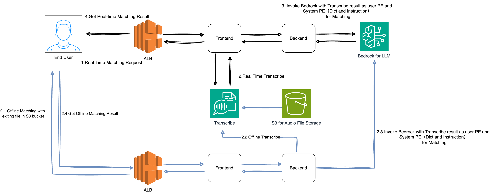

# VoiceSync

## Project Overview

VoiceSync is an advanced cloud-powered voice processing platform that leverages AWS services for high-precision speech transcription and text matching. The system supports real-time voice recording, transcription, and intelligent text analysis, providing a comprehensive solution for voice recognition and text processing.

### System Workflow



1. Start: The user initiates the system.
2. Fetch EC2 Role: The system retrieves the IAM role associated with the EC2 instance using IMDSv2.
3. Get Temporary Token: The system obtains temporary AWS credentials for service authentication.
4. Input the System Prompt
5. Choose Input Method: The user selects one of two input methods:
   - Real-time audio recording
   - S3 file upload
6. Audio Input: Based on the user's choice, one of the following actions is performed:
   - Record real-time audio, or
   - Upload an audio file to S3
7. Transcribe Audio: The system transcribes the audio input into text.
8. Bedrock Inference: The transcribed text is processed using AWS Bedrock for inference.
9. Display Results: The system displays the results of the transcription and inference.

This workflow covers the main functionalities of the VoiceSync system, including IAM Role-based authentication using IMDSv2, flexible audio input methods, audio transcription, AI-based inference, and result presentation.

## IAM Role Setup

Before deploying the application, you need to set up an IAM role with the necessary permissions:

1. Go to the AWS IAM console.
2. Create a new role for EC2.
3. Attach the following policies to the role:
   - AmazonTranscribeFullAccess
   - AmazonS3FullAccess
   - AWSBedrockFullAccess (or create a custom policy for Bedrock with the required permissions)
4. Name the role (e.g., "VoiceSyncEC2Role") and create it.

## Docker Deployment Guide

### Cloud Deployment with IAM Role

1. Launch an EC2 instance:
   - Choose an Amazon Linux 2 or Ubuntu AMI.
   - In the "Configure Instance" step, select the IAM role you created (e.g., "VoiceSyncEC2Role").
   - Configure other settings as needed (security group, key pair, etc.).
   - Ensure that IMDSv2 is enabled for the instance (this is the default for new instances).

2. Connect to your EC2 instance via SSH.

3. Install Docker and Docker Compose on your EC2 instance:
   ```bash
   # For Amazon Linux 2
   sudo yum update -y
   sudo amazon-linux-extras install docker
   sudo service docker start
   sudo usermod -a -G docker ec2-user
   sudo curl -L "https://github.com/docker/compose/releases/download/1.29.2/docker-compose-$(uname -s)-$(uname -m)" -o /usr/local/bin/docker-compose
   sudo chmod +x /usr/local/bin/docker-compose

   # For Ubuntu
   sudo apt update
   sudo apt install docker.io
   sudo systemctl start docker
   sudo systemctl enable docker
   sudo usermod -aG docker ubuntu
   sudo curl -L "https://github.com/docker/compose/releases/download/1.29.2/docker-compose-$(uname -s)-$(uname -m)" -o /usr/local/bin/docker-compose
   sudo chmod +x /usr/local/bin/docker-compose

   # Modify Hop of
   aws ec2 modify-instance-metadata-options --instance-id <Current_EC2_ID> --http-tokens required --http-endpoint enabled --http-put-response-hop-limit 2
   ```

4. Clone your VoiceSync repository to the EC2 instance.
   ```
   git clone https://github.com/jansony1/voice_matching_test.git && cd voice_matching_test

5. Configure ALB (Application Load Balancer):
   - Create an ALB in the AWS Console if you haven't already.
   - Add a listener rule for HTTPS (port 443), with the default rule pointing to the EC2 deployment on port 8080.
   - Set a new rule to forward requests with the path pattern `/api/*` to the backend service (EC2 instance port 8000).
   - Ensure that the EC2 security group (8080/8000) is open to the ALB security group.
   - Ensure that the ALB security group has port 443 open.
   - Set up an SSL/TLS certificate with AWS Certificate Manager (ACM) for your domain, and associate it with above 443 port

6. Create Environment Variables with Backend URL:
   ```bash
   # Create .env file
   cat > .env << EOL
   AWS_DEFAULT_REGION=us-west-2
   # Use your ALB domain name
   BACKEND_URL=https://your-alb-address.com/api
   EOL
   ```

7. Build and Start Services:
   ```bash
   ### start the full stack
   docker-compose up --build -d

   ### clean up the stack
   docker-compose down

   ```

8. Access Application:
   Open https://your-alb-address.com in your web browser.

### Using the Application

1. Open the application in your web browser.
2. Click the "Get EC2 Role and Start" button to fetch the IAM role and temporary token.
3. Once authenticated, you can use the real-time speech transcription or S3 file upload features.

### Configuration Notes

1. Backend URL Configuration
   - Set via BACKEND_URL environment variable in the .env file
   - Should include the `/api` prefix

2. AWS Region Configuration
   - AWS_DEFAULT_REGION: AWS region where your services are deployed (default: us-west-2)

3. Backend API Prefix
   - All backend API routes are prefixed with `/api`
   - For example, the EC2 role fetching endpoint is `/api/get_ec2_role`

### Project Structure
```
.
├── frontend/                      # Vue.js frontend application
│   ├── src/                      # Source code
│   ├── public/                   # Static assets
│   └── Dockerfile               # Frontend Docker configuration
├── backend/                      # Python backend service
│   ├── main.py                  # Main application entry point
│   ├── services/                # Modular service components
│   │   ├── config.py            # Configuration and constants
│   │   ├── logging_utils.py     # Logging management
│   │   ├── aws_utils.py         # AWS-related utilities
│   │   ├── bedrock_service.py   # Bedrock API interactions
│   │   └── transcription_service.py  # Audio transcription logic
│   ├── Dockerfile               # Backend Docker configuration
│   └── requirements.txt         # Python dependencies
└── docker-compose.yml           # Docker Compose configuration
```


### Common Issues and Troubleshooting

1. Connection Error
```
Error: net::ERR_CONNECTION_REFUSED
```
Solution:
- Verify BACKEND_URL configuration, ensure it includes the `/api` prefix
- Check if the backend service is running and accessible
- Ensure the ALB and security groups are correctly configured

2. IAM Role Error
```
Error fetching EC2 role
```
Solution:
- Ensure the EC2 instance has the correct IAM role attached with the necessary permissions
- Check that IMDSv2 is enabled and accessible (http://169.254.169.254 should be reachable from the instance)
- Verify that the instance has the necessary permissions to access the IMDS

3. Mixed Content Error
If you see mixed content errors, ensure all requests (including backend API calls) use HTTPS.

4. CORS Issues
If you encounter CORS-related errors, verify that the CORS settings in the backend (FastAPI CORS middleware) are correctly configured to allow requests from your frontend domain.

## Development Considerations

1. Backend API Routes
   All backend API routes are prefixed with `/api`. When developing new endpoints, there's no need to include `/api` in the route definition as it's already set globally in the FastAPI application.

2. Frontend API Calls
   Ensure all API calls to the backend use the correct URL, including the `/api` prefix. This is typically configured through the `BACKEND_URL` environment variable.

3. IAM Role and Temporary Credentials
   - The backend fetches the EC2 role and temporary credentials using IMDSv2
   - The frontend receives the temporary token from the backend
   - The backend refreshes the temporary credentials automatically when needed
   - Ensure your IAM role has the minimum necessary permissions for your application's functionality

4. Local Development
   For local development without an EC2 instance, you may need to modify the authentication method or use AWS credentials directly. Ensure you don't commit any sensitive information to version control.

5. Security Considerations
   - Always use HTTPS in production
   - Regularly rotate and update IAM roles and policies
   - Monitor AWS CloudTrail logs for any suspicious activities
   - Implement proper error handling to avoid exposing sensitive information

## License
MIT License
